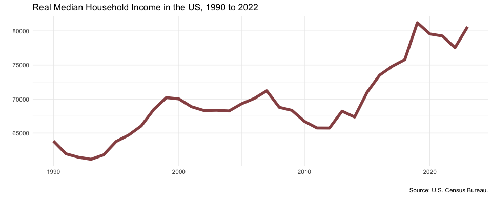

Week 5 Applications
================
2025-02-13

- [Web scrapping](#web-scrapping)
  - [Demographics in Singapore](#demographics-in-singapore)
  - [Gross monthly income in
    Singapore](#gross-monthly-income-in-singapore)
- [Working with APIs](#working-with-apis)
  - [Real median household income](#real-median-household-income)
  - [Realtime Carpark availability](#realtime-carpark-availability)

``` r
# Load packages
library(tidyverse)
library(rvest)
library(polite)
library(httr)
library(jsonlite)
```

# Web scrapping

## Demographics in Singapore

In the first practice,we shall visit the page
<https://en.wikipedia.org/wiki/Demographics_of_Singapore>, which contain
multiple tables for demographics in Singapore.

We will obtain the tables on

- Gender composition of resident population, and

- household income from work.

``` r
url <- "https://en.wikipedia.org/wiki/Demographics_of_Singapore"
url_use <- bow(url)
results <- scrape(url_use) %>% 
  html_elements("table.wikitable") %>% html_table()
gender_compo <- results[[5]]
household_income <- results[[21]]
```

``` r
gender_compo
```

<div class="kable-table">

| Year | 1960 | 1965 | 1970 | 1975 | 1980 | 1985 | 1990 | 1995 | 2000 | 2005 | 2010 | 2015 | 2020 |
|:---|:---|:---|:---|:---|:---|:---|:---|:---|:---|:---|:---|:---|:---|
| Total | 1,646.4 | 1,886.9 | 2,013.6 | 2,262.6 | 2,282.1 | 2,482.6 | 2,735.9 | 3,013.5 | 3,273.4 | 3,467.8 | 3,771.7 | 3,902.7 | 4,044.2 |
| Males | 859.6 | 973.8 | 1,030.8 | 1,156.1 | 1,159.0 | 1,258.5 | 1,386.3 | 1,514.0 | 1,634.7 | 1,721.1 | 1,861.1 | 1,916.6 | 1,977.6 |
| Females | 786.8 | 913.1 | 982.8 | 1,106.5 | 1,123.1 | 1,224.2 | 1,349.6 | 1,499.5 | 1,638.7 | 1,746.7 | 1,910.6 | 1,986.1 | 2,066.7 |
| Sex ratio (males per 1,000 females) | 1,093 | 1,066 | 1,049 | 1,045 | 1,032 | 1,028 | 1,027 | 1,010 | 998 | 985 | 974 | 965 | 957 |

</div>

``` r
household_income
```

<div class="kable-table">

| Year           | 1990  | 1995  | 1997  | 1998  | 1999  | 2000  | 2010  | 2011  | 2017   |
|:---------------|:------|:------|:------|:------|:------|:------|:------|:------|:-------|
| Average income | 3,076 | 4,107 | 4,745 | 4,822 | 4,691 | 4,943 | 8,726 | 9,618 | 11,589 |
| Median income  | 2,296 | 3,135 | 3,617 | 3,692 | 3,500 | 3,607 | 5,600 | 6,307 | 8,846  |

</div>

## Gross monthly income in Singapore

Next, visit the page

<https://stats.mom.gov.sg/Pages/Income-Summary-Table.aspx>

And obtain the first table on the median gross monthly income from
employment.

``` r
url <- "https://stats.mom.gov.sg/Pages/Income-Summary-Table.aspx"
url_use <- bow(url)
selector <- "#iMAS_SP_Summ"
tables <- scrape(url_use) %>% html_elements(selector) %>% html_table() # list of 6
df <- tables[[1]]
df
```

<div class="kable-table">

| Mid-Year    | 2014  | 2015  | 2016  | 2017  | 2018  | 2019  | 2020  | 20​21  | 2022  | 2023  | 2024  |
|:------------|:------|:------|:------|:------|:------|:------|:------|:------|:------|:------|:------|
| Levels (\$) | 3,770 | 3,949 | 4,056 | 4,232 | 4,437 | 4,563 | 4,534 | 4,680 | 5,070 | 5,197 | 5,500 |
| Mid-Year    | 2014  | 2015  | 2016  | 2017  | 2018  | 2019  | 2020  | 2021  | 2022  | 2023  | 2024  |

</div>

# Working with APIs

## Real median household income

As API calls to FRED requires an API key, we need to sign up for an API
key first.

- In the code below, my API key is retrieved in
  `Sys.getenv("FRED_KEY")`. This is one way to keep the API key secret.
  You can find out more about it
  [here](https://daattali.gitbooks.io/stat545-ubc-github-io/content/bit003_api-key-env-var.html).

``` r
resource_url <- "https://api.stlouisfed.org/fred/series/observations"
query_params = list(api_key = Sys.getenv("FRED_KEY"),
                    series_id = "MEHOINUSA672N",
                    file_type = "json")
# Request data from the server
res = GET(resource_url, query = query_params)

# Parse JSON
res_list <- content(res, type = "text") %>% fromJSON(flatten = TRUE)

# Convert data into tibble
income <- as_tibble(res_list$observations)
head(income)
```

<div class="kable-table">

| realtime_start | realtime_end | date       | value |
|:---------------|:-------------|:-----------|:------|
| 2025-01-28     | 2025-01-28   | 1984-01-01 | 58930 |
| 2025-01-28     | 2025-01-28   | 1985-01-01 | 60050 |
| 2025-01-28     | 2025-01-28   | 1986-01-01 | 62280 |
| 2025-01-28     | 2025-01-28   | 1987-01-01 | 63060 |
| 2025-01-28     | 2025-01-28   | 1988-01-01 | 63530 |
| 2025-01-28     | 2025-01-28   | 1989-01-01 | 64610 |

</div>

``` r
income %>%
  mutate(year = year(date), value = as.numeric(value)) %>%
  filter(year >= 1990) %>%
  ggplot(aes(x = year, y = value)) +
  geom_line(lwd = 2, color = "indianred4", alpha = 0.9) +
  theme_minimal() +
  labs(x = "", y = "", title = "Real Median Household Income in the US, 1990 to 2022",
       caption = "Source: U.S. Census Bureau.")
```

<!-- -->

## Realtime Carpark availability

To query data from the LTA DataMall, we also need to request an API key.

- In the code below, my API key is retrieved in `Sys.getenv("LTA_KEY")`.

- Read the LTA’s **documentation** for their APIs and understand how to
  set up the `GET()` requests.

``` r
# Construct the resource URL
resource_url <- "http://datamall2.mytransport.sg/ltaodataservice/CarParkAvailabilityv2"
# Make the GET() request
res <- GET(resource_url, 
           add_headers(AccountKey = Sys.getenv("LTA_KEY"),
                       accept = "application/json"))
# Parse the returned data
res_content <- content(res, as = "text")
res_list <- fromJSON(res_content, flatten = TRUE)
# Extract information from sub-list
df_carpark <- as_tibble(res_list$value)
head(df_carpark)
```

<div class="kable-table">

| CarParkID | Area | Development | Location | AvailableLots | LotType | Agency |
|:---|:---|:---|:---|---:|:---|:---|
| 1 | Marina | Suntec City | 1.29375 103.85718 | 661 | C | LTA |
| 2 | Marina | Marina Square | 1.29115 103.85728 | 1347 | C | LTA |
| 3 | Marina | Raffles City | 1.29382 103.85319 | 546 | C | LTA |
| 4 | Marina | The Esplanade | 1.29011 103.85561 | 615 | C | LTA |
| 5 | Marina | Millenia Singapore | 1.29251 103.86009 | 602 | C | LTA |
| 6 | Marina | Singapore Flyer | 1.28944 103.86311 | 252 | C | LTA |

</div>

### The `ltaer` package

there’s also an API wrapper `R` package, `ltaer`, that helps us obtain
data from the LTA DataMall.

- Read the full documentation of the package
  [here](https://shaunkhoo.github.io/ltaer/index.html).

- To obtain data via this API wrapper, we still need to supply our own
  API KEY.

- The data set on carpark availability can be retrieved with:

``` r
# Retrieve data on carpark availability
carpark_avail <- ltaer::getCarparkAvail(Sys.getenv("LTA_KEY"))
head(carpark_avail)
```

<div class="kable-table">

| CarParkID | Area | Development | Location | AvailableLots | LotType | Agency | lat | lng |
|:---|:---|:---|:---|---:|:---|:---|:---|:---|
| 1 | Marina | Suntec City | 1.29375 103.85718 | 661 | C | LTA | 1.29375 | 103.85718 |
| 2 | Marina | Marina Square | 1.29115 103.85728 | 1347 | C | LTA | 1.29115 | 103.85728 |
| 3 | Marina | Raffles City | 1.29382 103.85319 | 546 | C | LTA | 1.29382 | 103.85319 |
| 4 | Marina | The Esplanade | 1.29011 103.85561 | 615 | C | LTA | 1.29011 | 103.85561 |
| 5 | Marina | Millenia Singapore | 1.29251 103.86009 | 602 | C | LTA | 1.29251 | 103.86009 |
| 6 | Marina | Singapore Flyer | 1.28944 103.86311 | 252 | C | LTA | 1.28944 | 103.86311 |

</div>

### Car park availability: Visualization

Lastly, let’s try visualize the real-time car park availability. We will
need an additional package,
[leaflet](https://rstudio.github.io/leaflet/).

``` r
library(leaflet)
df_carpark <- carpark_avail %>%
  separate(Location, into = c("lat", "long"), sep = " ", convert = TRUE)

# Visualization
leaflet(df_carpark) %>%
  addTiles() %>%
  addCircleMarkers(lng = ~long, lat = ~lat,
                   popup = ~paste0("Available slots: ", AvailableLots),
                   radius = ~AvailableLots/100, stroke = FALSE, fillOpacity = 0.5)
```
